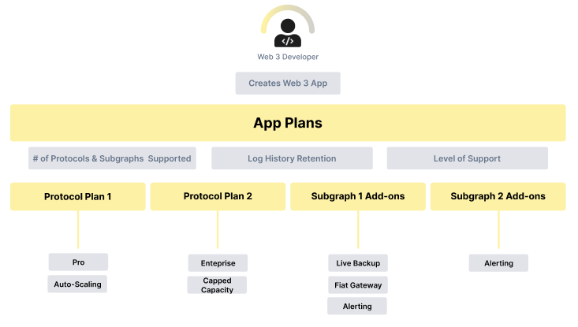
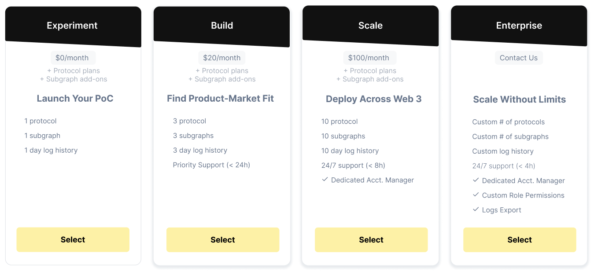
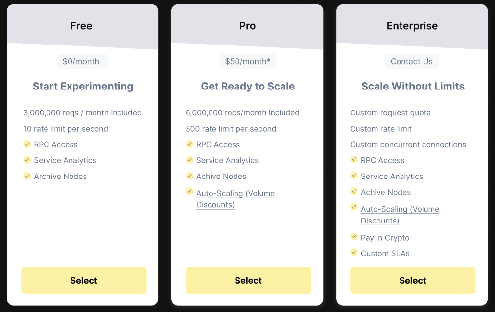
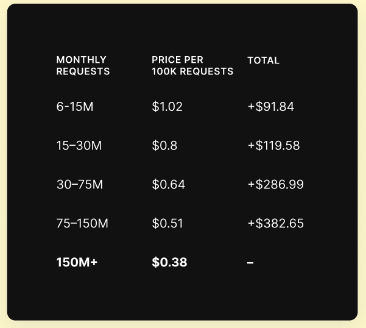

# 💵 DataHub 2.0 Pricing Model

## DataHub 2.0 Pricing Guide&#x20;

DataHub is evolving and so is its pricing! We are moving to a modular pricing model so your App can truly scale with your needs. We are introducing App plans, which allow you to manage your project, and we are simplifying the protocol plans to move to metered-billing with volume discounts so you can pay for exactly what you need. We will also be gradually introducing add-ons for integrated protocols such as The Graph.

An App is composed of an App plan, and one to multiple protocols (RPC services). The number of protocols you have within an App depends on the App plan, as well as the level of support and analytics you will obtain across these protocols.

Each protocol has its own plan to provide you with full control over how you grow across protocols.

Each integrated protocol like The Graph will have their own add-ons to complement access to the protocol.

### Introducing DataHub 2.0 App plans&#x20;

With the launch of Apps, we had to create new plans that would separate analytics and support from the protocol plans so that you could unify your level of service across your App, no matter the plans you choose for our RPC services.

App plans unlock:&#x20;

* Higher levels of support&#x20;
* Longer log history retention&#x20;
* Higher number of protocols that can be added to your App

### Moving to Metered-Billing for RPC Services

We have decided to move to metered-billing with volume discounts so we can grow with our customers and make it easier for them to get access to the capacity required for their scale at any given time.

We are hence simplifying our model to three plans: Free, Pro (with the ability to unlock auto-scaling), and Enterprise.

The new Pro plan starts with 6m requests included per month for $50/month. Users have the option to be capped at this capacity or to unlock auto-scaling with volume discounts, which will follow the pricing from the table above. At any time users will be able to modify their subscription to capped capacity or auto-scaling.

The new Enterprise plans also have the option for auto-scaling for customers who prefer having a variable subscription instead of a fixed deal.


Note that subscriptions created before the migration to DataHub 2.0 pricing have been grandfathered into the metered-billing model and benefit from more included requests. We have adjusted our pricing to better reflect the competitive landscape but still are the most affordable option among major players.


Please reach out to **datahub@figment.io** for any questions or inquiries related to the new pricing model.
