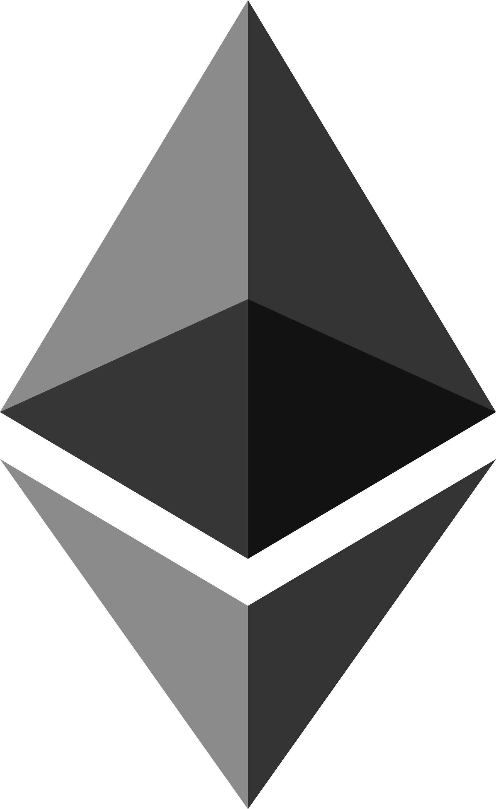
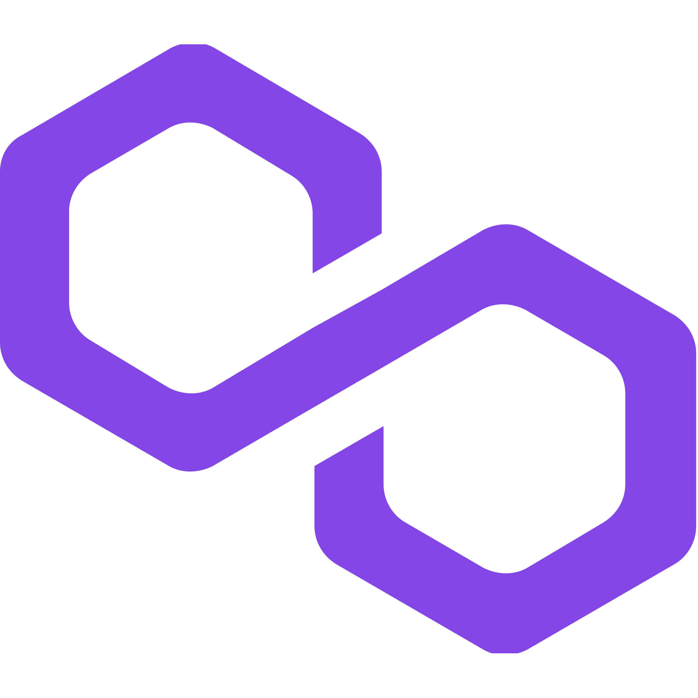

# 🔭 Network Guide

## 📍 Choosing a Network

Each Web 3 protocol has its own way of operating and can have a multitude of networks and environments to build on. Be sure to understand what's available before getting started!

### Testnet

If you're a developer considering building on a network and want to experiment before deploying in a production environment, you should first build on its testnet. You will be able to try tutorials and dive deeper into the network's available methods, without the on-chain costs affiliated with smart contract deployment.

You should always be able to obtain testnet tokens via a faucet. You can find the links on the network pages under "Network Documentation" on Learn.

### Mainnet

When you are ready to move to a production environment, you can deploy your application on the network's mainnet. On mainnet, you will be able to process real-world public transactions and events and start attracting real users to get you to the next level.

##  Avalanche

Avalanche is a layer one protocol by Ava Labs that offers high-throughput, fast finality, and unprecedented decentralization. Developers are able to launch their own public or private blockchains (called subnets), create and trade digital assets, and build scalable smart contracts and decentralized applications.


[avalanche](avalanche/)


##  (2) (2) (2) (2) (2) (2) (2) (2) (2) (2) (2) (2) (6).png>) Celo

Celo is a smart contract blockchain network. The technology uses a phone-number-based identity system with address-based encryption and eigentrust-based reputation. Their first application is a social payments system that can be used on a smartphone.


[celo](celo/)


##  Centrifuge

**Centrifuge** is a network that provides access to fast, cheap capital for small businesses and stable yield for investors. **Centrifuge Chain is the home for real-world assets (RWA) on-chain.** It is a Proof-of-Stake blockchain built on [Substrate](https://www.parity.io/what-is-substrate/) that enables users to bring their assets on-chain as non-fungible tokens (NFTs).


[centrifuge](centrifuge/)


##  Cosmos

Cosmos provides tools that make it easy to build a new, custom-designed blockchain that may interoperate with an arbitrary number of others in the Cosmos network. Its transactions are fast and low-cost, and the network is scalable. Cosmos is intended to break the silos of blockchain economies by enabling assets to be transferred between one another. A custom Cosmos blockchain can be securely connected with other blockchains, increasing the rate of adoption and liquidity.


[cosmos](cosmos/)


##  Ethereum

Ethereum is a decentralized, open-source blockchain with smart contract functionality. It's a marketplace of financial services, games and apps that can't steal your data or censor you. Ethereum is one of the largest and most popular blockchain networks among developers.


[ethereum](ethereum/)


##  Fantom

Fantom is a high-performance, scalable, EVM-compatible, and secure smart-contract platform. Fantom’s mainnet deployment—Fantom Opera—is built on Fantom’s consensus mechanism, [Lachesis](https://www.fantom.foundation/lachesis-consensus-algorithm/). Fantom is a leaderless, asynchronous, and byzantine fault-tolerant Layer 1 blockchain protocol.


[fantom](fantom/)


##  Kusama

Kusama is an early release of Polkadot: a scalable, multichain network for radical innovation. Kusama serves as a proving ground that allows teams and developers to build and deploy a parachain, and experiment with Polkadot’s governance and NPoS functionality in a real environment.


[kusama](kusama/)


##  Mina

Mina is the first cryptocurrency protocol with a succinct blockchain. Current cryptocurrencies like Bitcoin and Ethereum store hundreds of gigabytes of data, and as time goes on, their blockchains will only increase in size. With Mina, however, no matter how much the usage grows, the blockchain always stays the same size - about 22kb (the size of a few tweets). This means participants can quickly sync and verify the network.


[mina](mina/)


##  NEAR

NEAR is a decentralized application platform that is secure enough to manage high-value assets like money or identity and performant enough to make them useful for everyday people, putting the power of the Open Web in their hands.


[near](near/)


## .png>) Oasis

The Oasis Network is the first privacy-enabled blockchain platform for open finance and a responsible data economy. Combined with its high throughput and secure architecture, the Oasis Network is able to power private, scalable DeFi, revolutionizing Open Finance and expanding it beyond traders and early adopters to a mass market.


[oasis](oasis/)


##  Osmosis

Osmosis is an advanced AMM protocol built using the Cosmos SDK that will allow developers to design, build, and deploy their own customized AMMs.


[osmosis](osmosis/)


##  Polkadot

Polkadot enables scalability by allowing specialized blockchains to communicate with each other in a secure, trust-free environment. It is built to connect and secure unique blockchains, whether they be public, permission-less networks, private consortium chains, or oracles and other Web3 technologies. It enables an internet where independent blockchains can exchange information under common security guarantees.


[polkadot](polkadot/)


##  Polygon

Polygon (Matic) Network is a sidechain-based scaling solution for public blockchains. It is based on an adapted implementation of Plasma framework. Polygon (Matic) provides scalability while ensuring a superior user experience in a secured and decentralized manner.


[matic](matic/)


##  Secret

Secret Network is the first blockchain with privacy-preserving smart contracts. That means applications built on Secret can utilize encrypted data without revealing it to anyone, even the nodes in the network. For the first time, Secret Network allows developers to build powerful, permissionless, privacy-preserving applications - Secret Apps.


[secret](secret/)


##  (2) (2) (2) (1) (2) (2) (2) (2) (2) (1) (3).png>) Solana

Solana is an open-source project implementing a new, high-performance, permissionless blockchain. Solana features a new timestamp system called Proof-of-History (PoH) that enables automatically ordered transactions. It also uses a Proof of Stake (PoS) consensus algorithm to help secure the network.


[solana](solana/)


##  (2) (2) (2) (2) (2) (2) (2) (2) (2) (2) (1) (2).jpg>) Terra

Terra is a blockchain protocol that supports stable programmable payments and open financial infrastructure development. One part of Terra’s value contributions, payments, in essence, replaces the complicated payments value chain, including credit card networks, banks, and payment gateways with a single blockchain layer.


[terra](terra/)

