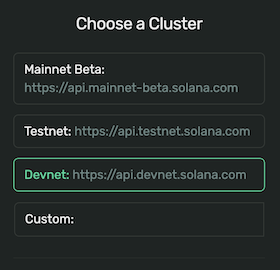

# 3. Fund the account

## Devnet, Testnet, Mainnet

With some protocols, different networks \(testnet, mainnet, etc\) have different tokens names. For example with Polkadot, the mainnet token is DOT and the testnet token is WND. But in the Solana world, the token is always called _SOL_, no matter what network \(or _cluster_\) you are on. But don't get too excited: the tokens you get for free on the devnet cannot be used on Solana's mainnet. Nice try though ;\)

Speaking of clusters, make sure you always know which one you're on. In your code, we already saw this when we created a `Connection` object. We passed the URL of a node and that node is connected to one of the clusters. When you're looking at the [Solana Explorer](https://explorer.solana.com/?cluster=devnet) you can select which cluster you want to look at by selecting it at the top right of the page:





## Airdropping

To fund an account, we will do what is called an _airdrop:_ some tokens will magically fall from the sky onto our wallets! This will provide us with some SOL so that we can test making transfers as well as view the transaction details on a block explorer.

To do this we will make use of the JS API's `requestAirdrop()` method. It takes an address and an amount designated in... _lamport_.


1 SOL is equal to 1,000,000,000 lamports.The name of lamports is in honour of Solana's biggest technical influence, [Leslie Lamport](https://en.wikipedia.org/wiki/Leslie_Lamport).


## The challenge


In `src/components/Fund.jsx`, implement `fund()`. Convert the text input to an address and use `requestAirdrop`to get 1 SOL.

**Need some help?** Here are a few hints.

    →  [Create a publicKey from a string](https://solana-labs.github.io/solana-web3.js/classes/PublicKey.html#constructor)  
    →  [`requestAirdrop()`documentation](https://solana-labs.github.io/solana-web3.js/classes/Connection.html#requestairdrop)


Take a few minutes to figure this out.

You can also ****[**join us on Discord**](https://discord.gg/fszyM7K) ****if you have questions.

Still not sure how to do this? No problem! The solution is below so you don't get stuck.

## The solution




```javascript
const fund = () => {
  const url = process.env.REACT_APP_DEVNET_URL;
  const connection = new Connection(url);
  
  // Create a PublicKey address from the input value
  // Call requestAirdrop
  // On success, set isFunded to true
}
```





```javascript
const fund = () => {
  const url = process.env.REACT_APP_DEVNET_URL;
  const connection = new Connection(url);
  
  const address = new PublicKey(value);
  
  connection.requestAirdrop(address, 1000000000)
    .then((res) => setIsFunded(true))
    .catch((err) => console.log(err))
}
```




**What happened in the code above?**

* We created a `PublicKey` from the input's value
* We passed it to `requestAirdrop` together with the amount of lamports we want to fund.
* On success we set `isFunded` to true

Once you have the code above saved, paste the address you generated in the previous step \(you can always go back using the "Previous Step" button\) and paste it in the text input.   
Then click on "Fund this Address" and you should see:


## Next

Before we make our first transfer, let's first check that that the account is correctly funded.

